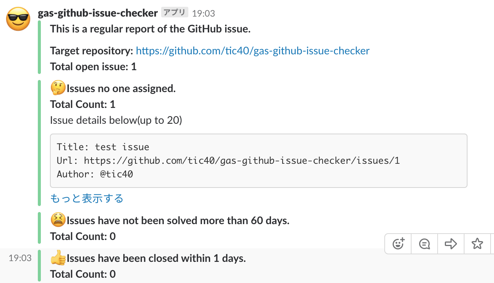

# gas-github-issue-checker

A tool by Google App Script.

## Description

This tool makes GitHub issue reports and send it to your Slack channel.

## Feature

- make a report of GitHub Issue in specific repository.
  - Count total open issues.
  - Make detail reports of the
    - open issues that no one assigned.
    - open issues that have not been solved within N days.
    - closed issues within N days.

## Setup

```
$ yarn install
$ yarn clasp create {project name} --rootDir ./src
```

## deploy

```
$ yarn deploy
```

And must set the script properties in the GAS project.
The properties are in src/index.ts. Please refer it.

## Demo


